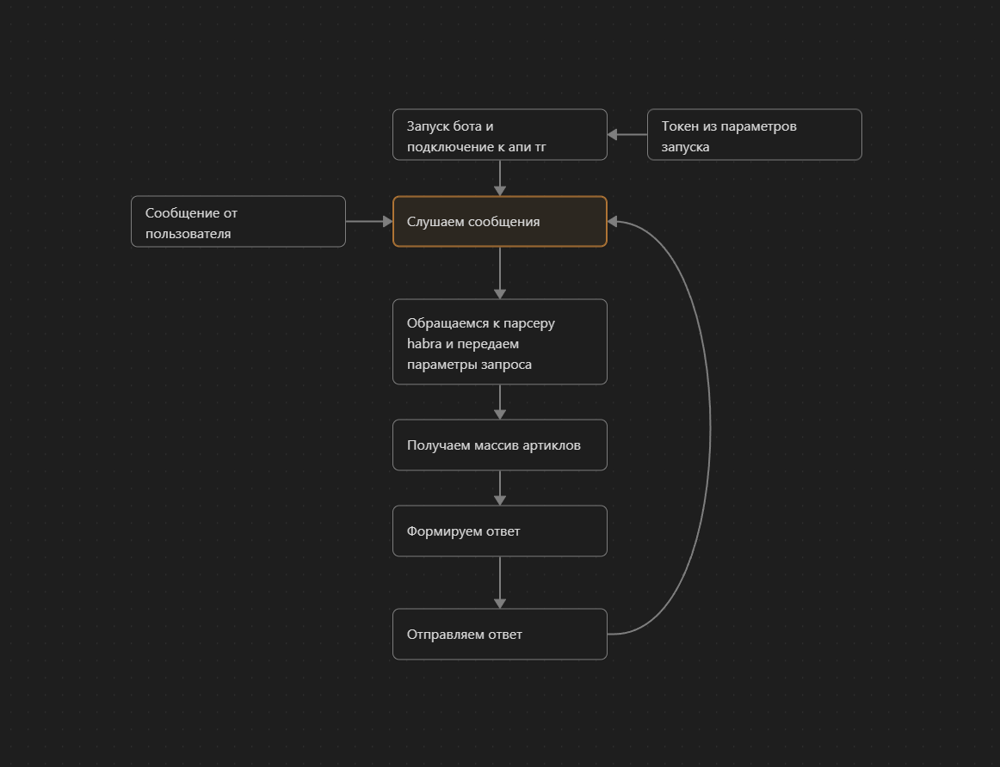

# HabrBot — Telegram-бот для чтения ленты Habr

## Что это?
Легковесный Telegram-бот на Java 21, который парсит ленту статей Habr и показывает карточки с титулом, превью-картинкой и кратким описанием. Из карточки можно открыть статью на сайте или запросить полный текст прямо в чате (бот корректно разбивает длинные сообщения, поддерживает MarkdownV2 и отправляет медиагруппы).

## Основные возможности
- 📰 Лента Habr с пагинацией (кнопки **◀️/▶️** и кнопка «📰 Лента»).
- Карточки: обложка (если есть), заголовок, краткое резюме, две кнопки:
    - **🔗 Открыть** — перейти на оригинал.
    - **📖 Показать полностью** — прислать полный текст и медиа.
- Отправка полной статьи:
    - преобразование HTML→MarkdownV2 (заголовки, списки, ссылки, инлайн-код и ```блоки```), добавляется ссылка на источник;
    - разбиение по лимиту Telegram и безопасная отправка с несколькими фоллбэками (MarkdownV2 → моно-блок → plain-text);
    - отправка 1 изображения или альбома (до 10) с подписью (caption).
- Устойчивость UX:
    - «часики» у колбэков сразу гасим `answerCallbackQuery`;
    - одноразовые безопасные токены в callback-data вместо URL;
    - рабочий пул для тяжёлых задач, чтобы не блокировать обработчик обновлений.

## Как работает
- `HabrParser` получает список статей со страницы ленты, вытаскивает: заголовок, ссылку, краткий текст, url картинки.
- `HabrBot` хранит состояние страницы на чат, рендерит карточки и обрабатывает:
    - команды `/start`, «📰 Лента», «◀️ Назад», «▶️ Вперёд»;
    - колбэки: `page:prev/next`, `f:<token>` для полного текста.
- Полный текст: страница статьи парсится, HTML конвертируется в MarkdownV2 (`HtmlToMarkdownV2`), текст режется на части (`MessageSplitter` + безопасное деление с учётом ```блоков```), медиа отправляются как `SendPhoto`/`SendMediaGroup`.
- Все user-visible тексты экранируются под MarkdownV2/HTML (`Markdown` + внутренние утилиты).

## Архитектура системы


## Процесс работы
1) Пользователь пишет боту или жмёт «📰 Лента».
2) Бот получает текущую страницу ленты, присылает 1–3 карточки.
3) Пользователь листает **◀️/▶️**, бот подгружает следующую/предыдущую страницу.
4) В карточке пользователь жмёт:
    - **🔗 Открыть** — переходит на habr.com;
    - **📖 Показать полностью** — бот парсит страницу, присылает изображения (1 или альбом) и затем полный текст, разбитый на сообщения.
5) При ошибках бот показывает короткое сервисное сообщение и даёт ссылку на статью.

## Быстрый старт
### Требования
- JDK **21+**
- Maven **3.9+**

### Сборка
```bash
mvn -q -DskipTests package
