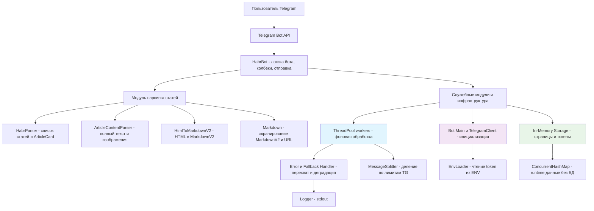

# План архитектуры

## 1. Общая архитектура системы

**HabrBot — Telegram-бот для чтения статей Habr**

Бот получает апдейты через Telegram Bot API, обрабатывает команды и колбэки в `HabrBot`, парсит список и содержимое статей модулями `HabrParser` и `ArticleContentParser`, форматирует текст в MarkdownV2 (`HtmlToMarkdownV2`, `Markdown`) и безопасно делит длинные сообщения (`MessageSplitter`). Состояние (страница ленты, одноразовые токены) хранится в памяти процесса.

*Документация подготовлена: Артём Карелин (https://github.com/Smaug05)*